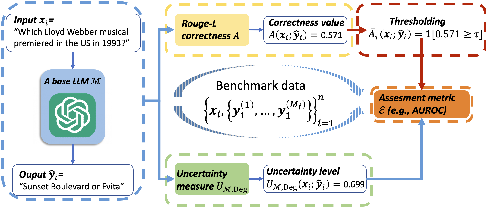
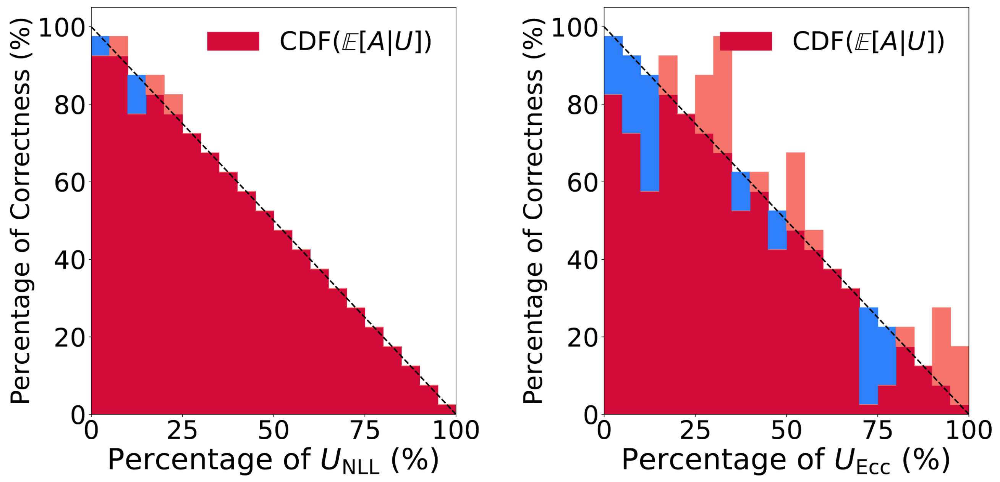

# **Uncertainty in Language Models: Assessment through Rank-Calibration**

## Abstract
Language Models (LMs) have shown promising performance in natural language generation. However, as LMs often generate incorrect or hallucinated responses, it is crucial to correctly quantify their uncertainty in responding to given inputs. In addition to verbalized confidence elicited via prompting, many uncertainty measures (e.g., semantic entropy and affinity-graph-based measures) have been proposed. However, these measures can differ greatly, and it is unclear how to compare them, partly because they take values over different ranges (e.g., $[0,\infty)$ or $[0,1]$). In this work, we address this issue by developing a novel and practical framework, termed Rank-Calibration, to assess uncertainty and confidence measures for LMs. Our key tenet is that higher uncertainty (or lower confidence) should imply lower generation quality, on average. Rank-calibration quantifies deviations from this ideal relationship in a principled manner, without requiring ad hoc binary thresholding of the correctness score (e.g., ROUGE or METEOR). The broad applicability and the granular interpretability of our methods are demonstrated empirically.

## LM Uncertainty/Confidence Assessment and Rank-Calibration

Common workflow for assessing the quality of an LM uncertainty/confidence measure. The key ingredients are: a base LM $\cM$ (e.g.,  Llama-2-7b-chat), a correctness function $A$ (\eg, the Rouge-L score), a benchmark dataset $\{\bx_i,\{\by_i^{(m)}\}_{m=1}^{M_i}\}_{i=1}^n$ (\eg, TriviaQA), an assessment metric $\cE$ (e.g., AUROC), and the uncertainty measure $U$ (\eg, $U_{\rm Deg}$). The workflow proceeds in five stages: \textcolor{generation}{generation}, \textcolor{correctness-justification}{correctness calculation}, \textcolor{correctness-discretization}{correctness discretization}, \textcolor{uncertainty-quantification}{uncertainty quantification}, and  $\textcolor{evaluation}{evaluation}$. Notably, the threshold $\tau$ in \textcolor{correctness-discretization}{correctness discretization} is usually chosen heuristically, which can be problematic, as demonstrated in Sec.~\ref{sec:case-study}. Our proposed Rank-Calibration *removes* this stage by using the correctness values directly.

## Indication Diagram

*Indication diagrams* comparing two uncertainty measures, $U_{\rm NLL}$ (negative log-likelihood) and $U_{\rm Ecc}$ (eccentricity), for the GPT-3.5-turbo model on the TriviaQA benchmark. The red bars indicate the average correctness of different outputs, as a function of the corresponding relative uncertainty levels. The \textcolor{blue}{blue} and \textcolor{shallow red}{shallow red} areas---deviating from the anti-diagonal line---indicate where the uncertainty measures are over-optimistic and pessimistic, respectively. Their sum is our \emph{rank-miscalibration} metric (\ie, \ref{eqn:rank-ece}), which here is lower for {\em $U_{\rm NLL}$ than $U_{\rm Ecc}$}.